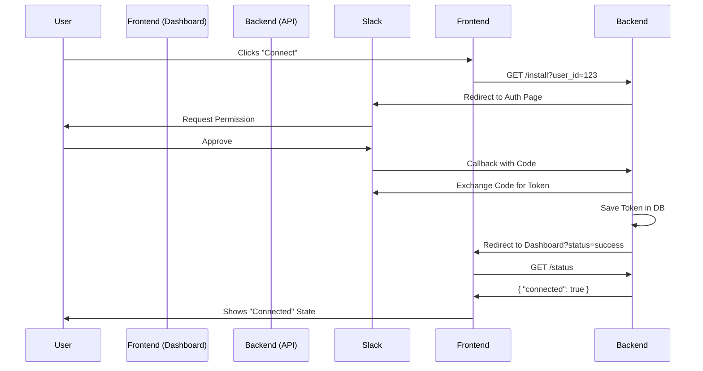

# Slack Integration Handoff: Frontend <-> Backend

This document defines the interface contract between the Frontend (Dashboard) and Backend (API) for Slack Integration.

---

## 1. Connection Flow (The "Install" Button)

**Goal:** User clicks "Connect Slack" on dashboard -> User ends up authenticated.

### A. Frontend Responsibility
1.  **Endpoint to Link:** The "Connect Slack" button MUST link to:
    ```
    {BACKEND_URL}/bot/slack/install?user_id={CURRENT_USER_ID}
    ```
    *   **Example:** `https://api.vibelets.ai/bot/slack/install?user_id=VL_TEST_USER`
    *   **Note:** `user_id` is critical. It identifies *who* is connecting.

2.  **Handling the Return:**
    After Slack auth, the Backend will redirect the user *back* to your dashboard.
    *   **Return URL:** `{DASHBOARD_URL}?status=success&platform=slack&uid={USER_ID}&team={TEAM_NAME}`
    *   **Frontend Action:**
        *   Check URL params on page load.
        *   If `status=success`, show a generic "Connected!" toast/notification.
        *   Do **NOT** rely solely on URL params for persistent state. Call the Status API (below) to update the UI switch.

---

## 2. Status Check (Is User Connected?)

**Goal:** Frontend needs to know if the "Connect" toggle should be ON or OFF.

### A. Frontend Request
*   **Method:** `GET`
*   **Endpoint:** `/bot/slack/status`
*   **Query Param:** `user_id={CURRENT_USER_ID}`

### B. Backend Response
**Scenario 1: Connected**
```json
{
  "connected": true,
  "team_name": "Adsparkx",
  "team_id": "T0A8...",
  "slack_user_id": "U0A8...",
  "email": "user@example.com"
}
```

**Scenario 2: Not Connected**
```json
{
  "connected": false
}
```

---

## 3. Disconnection Flow

**Goal:** User toggles "Off" or clicks "Disconnect".

### A. Frontend Request
*   **Method:** `POST`
*   **Endpoint:** `/bot/slack/disconnect`
*   **Query Param:** `user_id={CURRENT_USER_ID}`

### B. Backend Response
```json
{
  "ok": true,
  "message": "Disconnected successfully"
}
```
*   **Frontend Action:** Update UI state to "Disconnected" immediately upon `true` response.

---

## 4. Notifications (Testing / Manual Trigger) // Optional

**Goal:** Frontend wants to send a test alert to verify connection.

### A. Frontend Request
*   **Method:** `POST`
*   **Endpoint:** `/bot/notify`
*   **Payload (JSON):**
    ```json
    {
      "user_id": "USR_123",
      "platform": "slack",
      "title": "Test Alert",
      "summary": "This is a test notification triggered from the dashboard."
    }
    ```

### B. Backend Response
```json
{
  "slack": "sent"
}
```

---

## 5. Sequence Diagram (Simplified)


